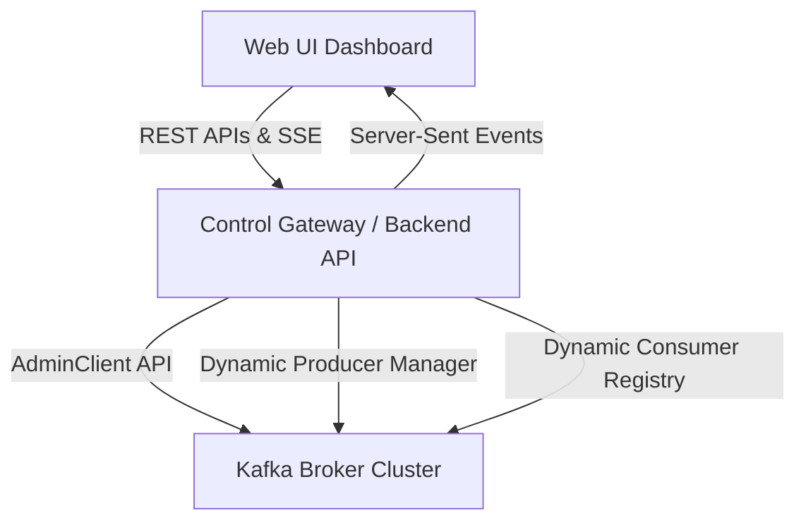
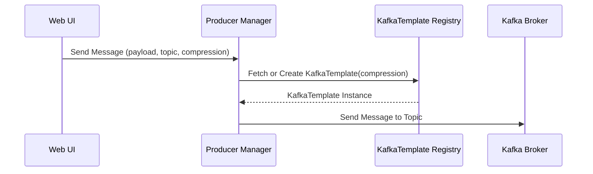
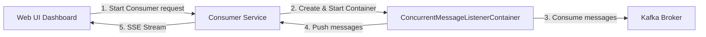

# Design Document: Runtime Dynamic Kafka Configuration

This design document outlines how to build an application that allows you to configure Kafka topics at runtime from a web UI, and make both the Kafka Producer and Kafka Consumer fully configurable on-the-fly.

---

## 1. Architectural Overview

To allow runtime adjustments, we bypass standard static configurations (like hardcoded `@KafkaListener` annotations and fixed properties) and interact directly with Kafka's programmatic APIs.



---

## 2. Core Components Design

### Component A: Topic Administration at Runtime
We use Kafka's `AdminClient` to query, create, and delete topics dynamically from the UI.

| API Endpoint | Method | Payload / Parameters | Description |
| :--- | :--- | :--- | :--- |
| `/api/admin/topics` | `GET` | None | Lists all active topics with partition and replication metadata. |
| `/api/admin/topics` | `POST` | `{ "name": "string", "partitions": 3, "replicationFactor": 1 }` | Programmatically creates a new topic. |
| `/api/admin/topics/{name}` | `DELETE` | None | Deletes an existing topic. |

#### Backend Implementation Snippet
```java
@RestController
@RequestMapping("/api/admin/topics")
public class KafkaAdminController {

    private final KafkaAdmin kafkaAdmin;

    public KafkaAdminController(KafkaAdmin kafkaAdmin) {
        this.kafkaAdmin = kafkaAdmin;
    }

    @PostMapping
    public ResponseEntity<String> createTopic(@RequestBody TopicRequest request) {
        try (AdminClient client = AdminClient.create(kafkaAdmin.getConfigurationProperties())) {
            NewTopic newTopic = new NewTopic(request.getName(), request.getPartitions(), request.getReplicationFactor());
            client.createTopics(Collections.singleton(newTopic)).all().get();
            return ResponseEntity.ok("Topic '" + request.getName() + "' created successfully.");
        } catch (Exception e) {
            return ResponseEntity.status(HttpStatus.INTERNAL_SERVER_ERROR).body(e.getMessage());
        }
    }
}
```

---

### Component B: Configurable Runtime Producer
Instead of publishing to a fixed topic configured in `application.yml`, we configure the REST endpoint to accept a target topic as a parameter. Additionally, if you need to modify producer behaviors (such as `acks`, `compression`, or `retries`) dynamically, we can maintain a registry of `KafkaTemplate` instances initialized with dynamic properties.



#### Backend Implementation Snippet
```java
@Service
public class DynamicProducerService {

    private final ProducerFactory<String, String> baseProducerFactory;
    private final ConcurrentHashMap<String, KafkaTemplate<String, String>> templateCache = new ConcurrentHashMap<>();

    public DynamicProducerService(ProducerFactory<String, String> baseProducerFactory) {
        this.baseProducerFactory = baseProducerFactory;
    }

    public void sendMessage(String topic, String message, Map<String, Object> dynamicConfigs) {
        KafkaTemplate<String, String> template = getTemplateForConfigs(dynamicConfigs);
        template.send(topic, message);
    }

    private KafkaTemplate<String, String> getTemplateForConfigs(Map<String, Object> configs) {
        String cacheKey = configs.toString();
        return templateCache.computeIfAbsent(cacheKey, key -> {
            // Merge base properties with dynamic configurations from UI
            Map<String, Object> mergedConfigs = new HashMap<>(baseProducerFactory.getConfigurationProperties());
            mergedConfigs.putAll(configs);
            DefaultKafkaProducerFactory<String, String> factory = new DefaultKafkaProducerFactory<>(mergedConfigs);
            return new KafkaTemplate<>(factory);
        });
    }
}
```

---

### Component C: Programmatic Dynamic Consumer
Standard Spring `@KafkaListener` annotations are loaded at application startup and cannot easily change topics or configuration at runtime. 
To make consumers dynamic, we use `ConcurrentMessageListenerContainer` managed via a `ConsumerRegistry`.

#### How Dynamic Consumers Work:
1. **Instantiation**: When a user clicks **"Start Consumer"** on the UI, the backend creates a `ConcurrentMessageListenerContainer` programmatically.
2. **Subscription**: The container is bound to the user's selected topic(s), group ID, and deserializer properties.
3. **Data Stream**: Incoming messages are consumed, logged, and streamed back to the UI in real-time via **Server-Sent Events (SSE)** or **WebSockets**.
4. **Shutdown**: When the user clicks **"Stop Consumer"**, the backend calls `.stop()` on the container instance and removes it from the registry.



#### Backend Implementation Snippet
```java
@Service
public class DynamicConsumerRegistry {

    private final ConsumerFactory<String, String> consumerFactory;
    private final Map<String, ConcurrentMessageListenerContainer<String, String>> activeContainers = new ConcurrentHashMap<>();
    private final SimpMessagingTemplate websocketTemplate; // For streaming to UI

    public DynamicConsumerRegistry(ConsumerFactory<String, String> consumerFactory, SimpMessagingTemplate websocketTemplate) {
        this.consumerFactory = consumerFactory;
        this.websocketTemplate = websocketTemplate;
    }

    public void startNewConsumer(String topic, String groupId) {
        String containerKey = topic + "-" + groupId;
        if (activeContainers.containsKey(containerKey)) {
            return; // Already running
        }

        ContainerProperties containerProps = new ContainerProperties(topic);
        containerProps.setGroupId(groupId);
        containerProps.setMessageListener((MessageListener<String, String>) record -> {
            // Push message to Web UI websocket channel
            websocketTemplate.convertAndSend("/topic/messages/" + containerKey, record.value());
        });

        ConcurrentMessageListenerContainer<String, String> container = 
            new ConcurrentMessageListenerContainer<>(consumerFactory, containerProps);
        container.start();
        activeContainers.put(containerKey, container);
    }

    public void stopConsumer(String topic, String groupId) {
        String containerKey = topic + "-" + groupId;
        ConcurrentMessageListenerContainer<String, String> container = activeContainers.remove(containerKey);
        if (container != null) {
            container.stop();
        }
    }
}
```

---

## 3. Web Dashboard Design UI

Here's the proposed layout of the Control Panel UI. It uses modern dark-mode glassmorphism with dynamic tabs for Topics, Producers, and Consumers:

### Dashboard Sections
1. **Topic Manager**:
   - Create new topics with custom partition counts and replication factors.
   - Table displaying active topics, partition sizes, and delete controls.
2. **Interactive Producer**:
   - Dropdown of active topics (refreshed dynamically).
   - Dynamic configuration editor (e.g. key serialization, custom headers, payload format).
   - Payload input area with JSON linting/prettify support.
   - "Send Message" execution button with status reports.
3. **Consumer Panel**:
   - Configure a dynamic listener by entering a custom `group-id` and picking a topic.
   - Stream viewer displaying live logs of messages consumed, complete with timestamp, partition ID, and payload styling.

---

## 4. Implementation Steps

If you want to proceed with this design, here are the steps we will take:
1. **Merge Microservices (Optional)** or use the existing producer/consumer structure. We can bundle the control panel backend within the `producer` service, since it already acts as the REST gateway.
2. **Add Dependencies**: Make sure Spring Web, Spring Kafka, and WebSocket support are present.
3. **Implement Controller & Service layer**: Add Admin endpoints, Dynamic Producer configs, and the Dynamic Consumer Registry.
4. **Develop HTML5/JS Dashboard**: Build a gorgeous single-page client with live console logging.
5. **Verify**: Spin up Kafka via Docker Compose and perform end-to-end testing of dynamic topics, live message publishing, and streaming consumption.
