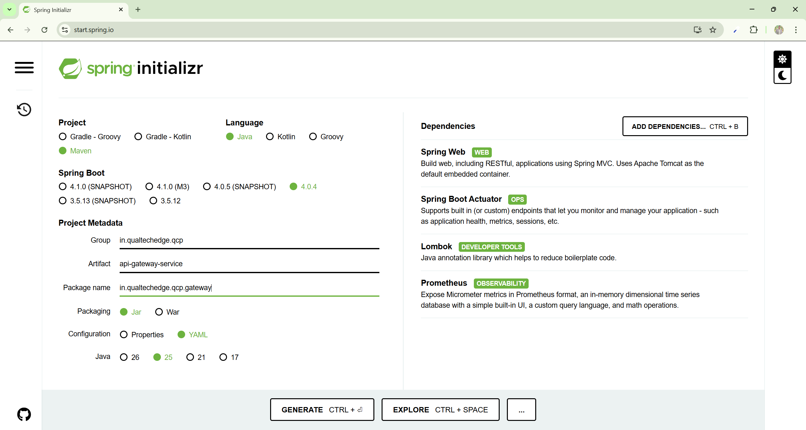

# Spring Boot Project Setup

## Qualtech Core Platform (QCP) Group Structure

### Understanding the Organization

**QCP** = **Qualtech Core Platform**. It is organized as a group with a capability **sub-group** for each area (e.g. `gateway`, `communication`, `reporting`); each Spring Boot service is its own **repository inside a sub-group**. For the full QCP repository layout, see the **[Repository Structure](../repository-structure.md)** standard.

### Service Naming Convention

**QCP Standard Pattern (locked across all services):**

- **groupId**: `in.qualtechedge.qcp`
- **artifactId**: Use the actual deployable service name
- **base package**: `in.qualtechedge.qcp.[sub-group]`

**Examples:**

- Sub-group: `gateway` → Repository / Artifact: `api-gateway-service` → Package: `in.qualtechedge.qcp.gateway`
- Sub-group: `reporting` → Repository / Artifact: `reporting-service` → Package: `in.qualtechedge.qcp.reporting`
- Sub-group: `communication` → Repository / Artifact: `notification-service` → Package: `in.qualtechedge.qcp.communication`

These map directly to the `pom.xml` identity, for example:

```xml
<groupId>in.qualtechedge.qcp</groupId>
<artifactId>api-gateway-service</artifactId>
<version>0.0.1-SNAPSHOT</version>
<packaging>jar</packaging>
```

This organizational structure ensures:

- **Clear separation** of concerns between capabilities
- **Consistent naming** across all QCP services

## Creating a New Spring Boot Project

### Using Spring Initializr

1. Navigate to [Spring Initializr](https://start.spring.io/)

2. Configure the project settings:
   - **Project**: Maven
   - **Language**: Java
   - **Spring Boot**: QCP-approved version
   - **Packaging**: Jar
   - **Java**: QCP-approved version
3. Set up Project Metadata:
   - **Group**: `in.qualtechedge.qcp`
   - **Artifact**: Use the actual deployable service name (e.g., `api-gateway-service`)
   - **Package name**: `in.qualtechedge.qcp.[sub-group]` (e.g., `in.qualtechedge.qcp.gateway`)
   - **Config file standard**: Use `application.yaml`
   
4. Add Dependencies (as needed):
   - **Spring Web**: For REST APIs
   - **Validation**: For `jakarta.validation` constraints on request DTOs
   - **Spring Boot Actuator**: For monitoring and management
   - **Prometheus Exporter**: For metrics export via Micrometer
   - **Lombok**: For reducing boilerplate code
5. Click **GENERATE** to download the project ZIP file
6. Extract the ZIP file and open the project in your IDE
7. If the generated project contains `application.properties`, replace it with `application.yaml` as per QCP standard

### Recommended Dependencies for QCP Services

For most QCP microservices, include these dependencies:

- Spring Web (REST endpoints)
- Validation (request DTO validation)
- Spring Boot Actuator (health checks, metrics)
- Prometheus Exporter (metrics export via Micrometer)
- Lombok (code generation)

**Note (Spring Boot 4.x)**: `spring-boot-starter-web` was renamed to **`spring-boot-starter-webmvc`** in Spring Boot 4; the old starter name is deprecated.

### Project Structure

After generation, the project will have this structure:

```text
[service-name]/
├── src/
│   ├── main/
│   │   ├── java/in/qualtechedge/qcp/[sub-group]/
│   │   │   └── [ServiceName]Application.java
│   │   └── resources/
│   │       └── application.yaml
│   └── test/
├── .gitattributes
├── .gitignore
├── pom.xml
└── README.md
```

### POM.xml Configuration

**Important**: QCP versioning rule:

- Use `0.0.1-SNAPSHOT` during active development
- Use `0.0.1` only for tagged or release-ready builds

```xml
<version>0.0.1-SNAPSHOT</version>
```

Also add the `finalName` configuration inside the `<build>` section:

```xml
<build>
    <finalName>${project.artifactId}-${project.version}</finalName>
</build>
```

## POM.xml Dependency Rules

Add comments above dependency groups and for non-obvious dependencies.

**Group dependencies** by category using section headers:

- `<!-- ==================== Spring Boot Starters ==================== -->`
- `<!-- ==================== Database ==================== -->`
- `<!-- ==================== Security ==================== -->`
- `<!-- ==================== Communication ==================== -->` (Twilio, Mail)
- `<!-- ==================== Cloud Services ==================== -->` (AWS, Azure, GCP)
- `<!-- ==================== Developer Tools ==================== -->`
- `<!-- ==================== Runtime / Provided ==================== -->`
- `<!-- ==================== Testing ==================== -->`

**Group similar items together within each category:**

- **Logging**: Logback, Logstash, SLF4J dependencies
- **Lombok**: Lombok core and annotation processor
- **Spring Boot**: All spring-boot-starter-* dependencies
- **AWS**: All AWS SDK dependencies together
- **Testing**: All testing frameworks (JUnit, Mockito, TestContainers)

**Comment format:** `<!-- ArtifactName: Brief description of what it provides -->`

**Example:**

```xml
<!-- ==================== Database ==================== -->
<!-- PostgreSQL JDBC driver for database connectivity -->
<dependency>
    <groupId>org.postgresql</groupId>
    <artifactId>postgresql</artifactId>
    <scope>runtime</scope>
</dependency>
```

### Application.yaml Configuration

**Important**: Always use YAML files (`.yaml`) instead of properties files (`.properties`) for configuration.

**Benefits of YAML over Properties:**

- **Hierarchy & Structure**: YAML supports nested configurations, making complex configurations more readable
- **Comments**: YAML allows inline comments, properties files do not
- **Readability**: Cleaner syntax without repetitive prefixes
- **Arrays & Lists**: Better support for complex data structures
- **Maintenance**: Easier to manage and update complex configurations

Add the following basic Actuator configuration to `src/main/resources/application.yaml`:

```yaml
# Actuator configuration
management:
  endpoints:
    web:
      base-path: /actuator
      exposure:
        include: health,info,prometheus
  endpoint:
    health:
      show-details: when_authorized
      show-components: when_authorized
```

### Next Configuration Steps

For advanced configurations including:

- Profile setup (local, dev, uat, prod)
- Database configuration
- Security setup
- API documentation
- Testing configuration
- Build and deployment pipelines

See: **[2. Spring Boot Project Standards](spring-boot-project-standards.md)**

### Running the Application

**Start the application using Maven:**

```bash
mvn spring-boot:run
```

Use an HTTP client such as `curl` to test the following endpoints:

**Health Endpoint:**

```bash
curl http://localhost:8080/actuator/health
```

**Prometheus Metrics Endpoint:**

```bash
curl http://localhost:8080/actuator/prometheus
```

**All Actuator Endpoints:**

```bash
curl http://localhost:8080/actuator
```
